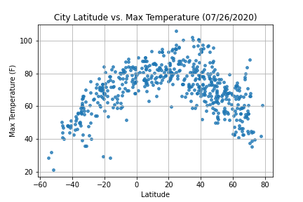
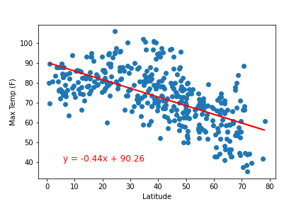
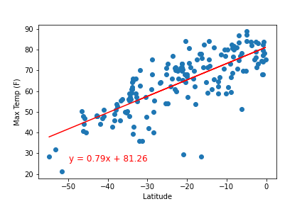
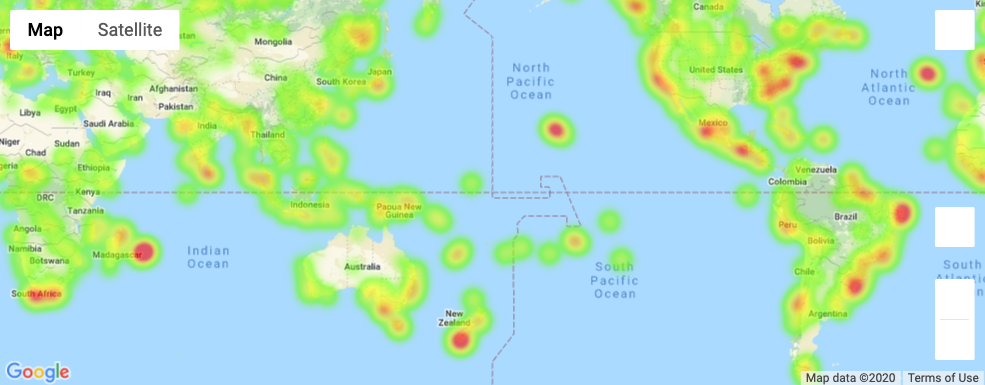
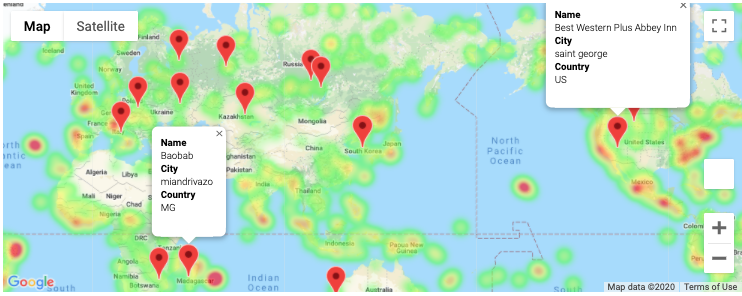

# API-Project

"What's the weather like as we approach the equator?"

## Part I - WeatherPy

* I created a Python script to visualize the weather of 500+ cities across the world of varying distance from the equator. I utilized a [simple Python library](https://pypi.python.org/pypi/citipy), the [OpenWeatherMap API](https://openweathermap.org/api) to create a representative model of weather across world cities.

* Created a series of scatter plots to showcase the following relationships:

* Temperature (F) vs. Latitude
* Humidity (%) vs. Latitude
* Cloudiness (%) vs. Latitude
* Wind Speed (mph) vs. Latitude

** Temperature vs Latitide Graph Image

* Run linear regression on each relationship, only this time separating them into Northern Hemisphere (greater than or equal to 0 degrees latitude) and Southern Hemisphere (less than 0 degrees latitude):

* Northern Hemisphere - Temperature (F) vs. Latitude
* Southern Hemisphere - Temperature (F) vs. Latitude
* Northern Hemisphere - Humidity (%) vs. Latitude
* Southern Hemisphere - Humidity (%) vs. Latitude
* Northern Hemisphere - Cloudiness (%) vs. Latitude
* Southern Hemisphere - Cloudiness (%) vs. Latitude
* Northern Hemisphere - Wind Speed (mph) vs. Latitude
* Southern Hemisphere - Wind Speed (mph) vs. Latitude

** I also created multiple linear regression plots with a function that created the linear regression plots.

** Northern Hemisphere - Temperature (F) vs. LatitudeGraph Image

** Southern Hemisphere - Temperature (F) vs. LatitudeGraph Image

### Part II - VacationPy

* Used jupyter-gmaps and the Google Places API.

* Created a heat map that displayed the humidity for every city from the part I.

** Humidity Heat Map

* Narrowed down the DataFrame to find my ideal weather condition and dropped any rows that didn't contain all three conditions. 

- Narrow down the cities with Max Temp > 65F, < 85F
- Narrow down the cities with Humidity < 55%
- Narrow down the cities with Ideal Wind Speed < 10mph

* Used Google Places API to find the first hotel for each city located within 5000 meters of my coordinates.

* Plotted the hotels on top of the humidity heatmap with each pin containing the **Hotel Name**, **City**, and **Country**.

** My ideal weather condition & Nearby hotel information

